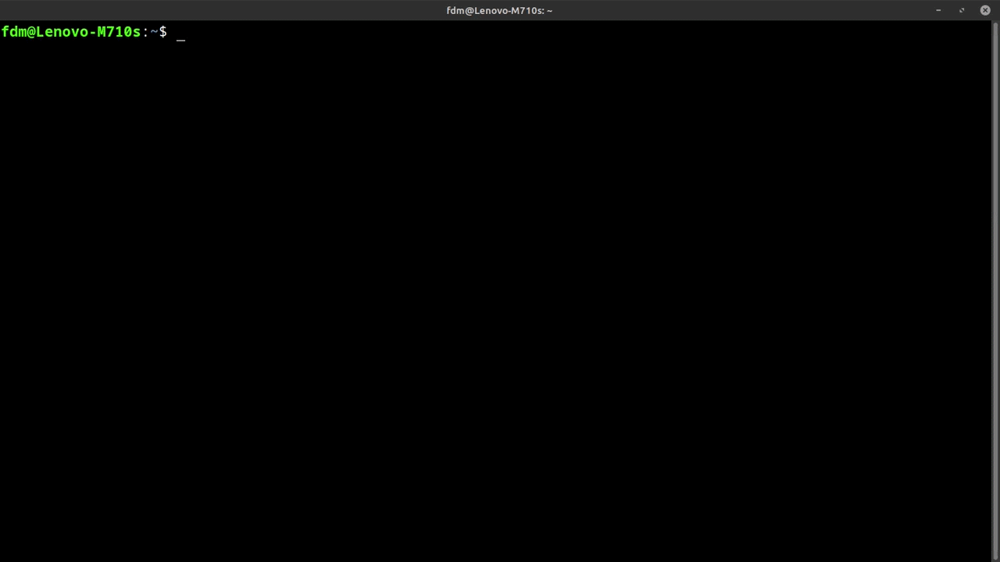

> [Habilidades Generales](../README.md) | [PicoCTF](../../README.md) | [CTF Write-Ups](../../../README.md)

# Super SSH
> _Challenge_ de Habilidades generales, PicoCTF.

> Español | [Inglés](./super-ssh_general-skills_picoctf_eng.md).

> [Versión en PDF](...).

<br>

---

<br>

## Descripción del _challenge_.
> Usar una instancia de _Secure Shell_ (SSH) va a ser muy importante.
>
> Todos los detalles adicionales van a estar disponibles en el posterior a darle inicio a la instancia. 
>

<br>

## Información dada por el _challenge_.
- _host_: " titan.picoctf.net ".
- _usuario_: " ctf-player ".
- _puerto_: " 61084 ".
- _contraseña_: " f3b61b38 ".

<br>

---

<br>

## Procedimiento.

<br>

1. .

<br>

```
	PS C:\Users\PC03Mostrador> ssh ctf-player@titan.picoctf.net -p 61084
	The authenticity of host '[titan.picoctf.net]:61084
    ([3.139.174.234]:61084)' can't be established.
	ED25519 key fingerprint is 	SHA256:4S9EbTSSRZm32I+cdM5TyzthpQryv5kudRP9PIKT7XQ.
	This key is not known by any other names.
	Are you sure you want to continue connecting (yes/no/[fingerprint])? yes
	Warning: Permanently added '[titan.picoctf.net]:61084' (ED25519) to the list of known hosts.
	ctf-player@titan.picoctf.net's password:
	Welcome ctf-player, here's your flag: picoCTF{s3cur3_c0nn3ct10n_3e293eea}
	Connection to titan.picoctf.net closed.

```

<br>

- [...].

<br>

```
	PS C:\Users\PC03Mostrador> ssh titan.picoctf.net -l ctf-player -p 61084
	ctf-player@titan.picoctf.net's password:
	Welcome ctf-player, here's your flag: picoCTF{s3cur3_c0nn3ct10n_3e293eea}
	Connection to titan.picoctf.net closed.

```

<br>

- [...].

<br>

---

<br>

### Adjuntos.

<br>

<p align="center">
  
</p>

> Procedimiento entero.

<br>

---

