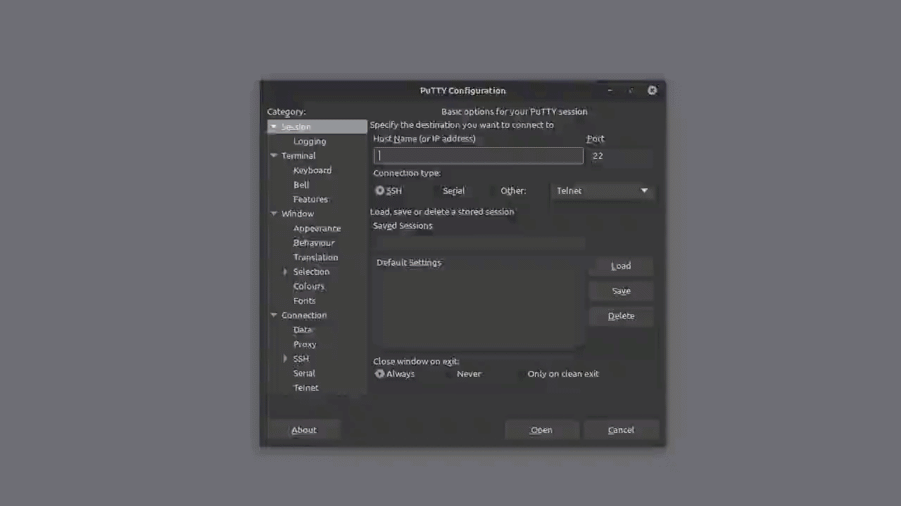

> [Century](../README.md) | [UnderTheWire](../../README.md) | [CTF Write-Ups](../../../README.md)

# [Level 1](https://underthewire.tech/century)
> Century Level 1

> English | [Spanish](./nivel-1_century_underthewire_esp.md).

> [PDF version]().

<br>

---

<br>

## Challenge description.
> The password for Century2 is the build version of the instance of PowerShell installed on this system.
>
> - NOTE:
> - The format is as follows: **xx.x.xxxxx.xxxx**\
> – Include all periods\
> – Be sure to look for build version and NOT PowerShell version
>
> IMPORTANT:
> Once you feel you have completed the Century1 challenge, start a new connection to the server, and log in with the username of Century2 and this password will be the answer from Century1. If successful, close out the Century1 connection and begin to solve the Century2 challenge. This concept is repeated over and over until you reach the end of the game.

<br>

## Information given by the challenge.
- _hostname_: " century.underthewire.tech ".
- _port_: " 22 " (2220).
- _user_: " century1 ".
- _password_: " century1 ".

<br>

---

<br>

## Procedure.

<br>

1. .

<br>

```

    PS C:\users\century1\desktop> $PSVersionTable 

```

<br>

---

<br>

2. .

<br>

---

<br>

3. .

<br>

---

<br>

### Attachments.

<br>

<p align="center">
  
</p>

> Entire procedure.

<br>

---
