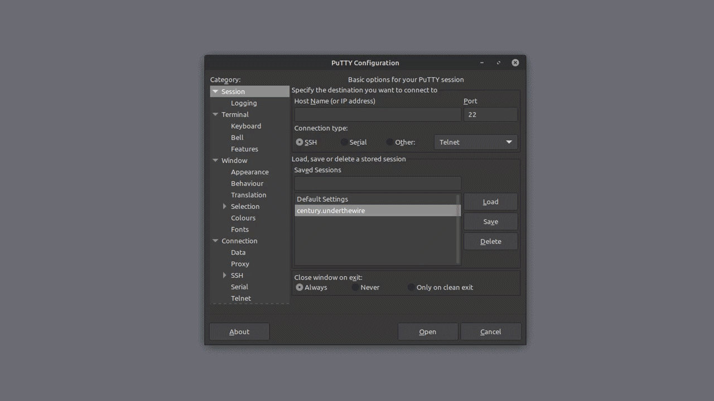
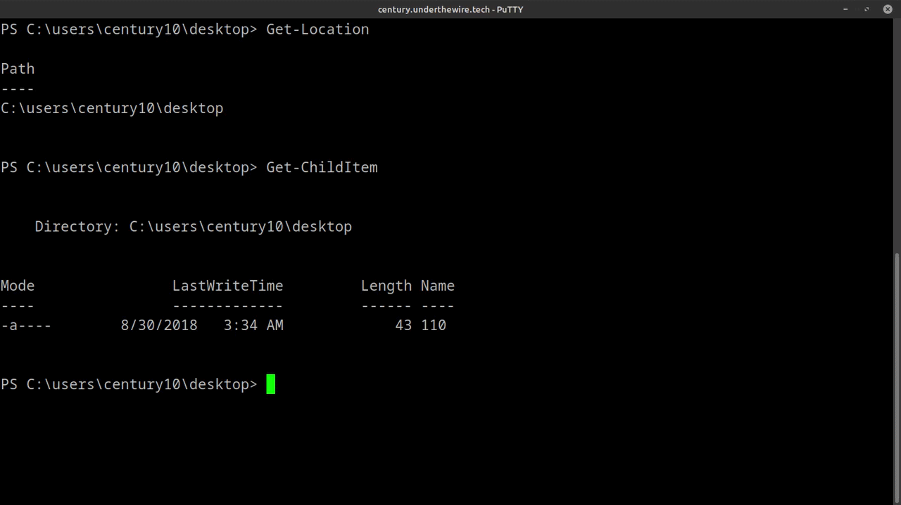

> [Century](../README.md) | [UnderTheWire](../../README.md) | [CTF Write-Ups](../../../README.md)

# [Level 10](https://underthewire.tech/century)
> Century, Level 10.

> English | [Spanish](./nivel-10_century_underthewire_esp.md).

> [PDF version](https://drive.google.com/file/d/1n78k1X_n6f7mPV9hmBGtcaTQw2v1OPFZ/view?usp=sharing).

<br>

---

<br>

## Challenge description.
> The password for Century11 is the 10th and 8th word of the Windows Update service description combined PLUS the name of the file on the desktop.
>
> IMPORTANT NOTE
>
> - The password will be lowercase no matter how it appears on the screen.
> - If the 10th and 8th word of the service description is “apple” and “juice” and the name of the file on the desktop is “88”, the password would be “applejuice88”.

<br>

## Information given by the challenge.
> Useful information from the current or previous levels.
- _hostname_: " century.underthewire.tech ".
- _port_: " 22 " (2220).
- _user_: " century10 ".
- _password_: " pierid ".

<br>

---

<br>

## Procedure.

<br>

1. Giving start to this level, we know that we have to get to know the name of a file that is on _desktop_ and the 10th and 8th words in the Windows Update services description and combine all of them to get the password for Century11.\
As a first step, from _desktop_, we can quickly use [Get-ChildItem](https://learn.microsoft.com/es-es/powershell/module/microsoft.powershell.management/get-childitem?view=powershell-7.5#:~:text=Obtiene%20los%20elementos%20y%20elementos%20secundarios%20de%20una%20o%20varias%20ubicaciones%20especificadas) to get to know the name of the file in there...

<br>

```powershell


	PS C:\users\century10\desktop> Get-ChildItem


        Directory: C:\users\century10\desktop


    Mode                LastWriteTime         Length Name
    ----                -------------         ------ ----   
    -a----        8/30/2018   3:34 AM             43 110


```

<br>

- And there it is, the file in question would be "`` 110 ``".

<br>

---

<br>

2. Now, when it comes to the other two words that are inside the Windows Update Services description, we can't use the [Get-Content](https://learn.microsoft.com/es-es/powershell/module/microsoft.powershell.management/get-content?view=powershell-7.5#:~:text=Obtiene%20el%20contenido%20del%20elemento%20en%20la%20ubicaci%C3%B3n%20especificada.) cmdlet, this cmdlet is designed to work with file-system items, like text files or logs, not executable files that run on the background, like services. Consequently, this command is not going to be of utility to read the contents of a service. So, starting from that point, we can try with [Get-CimInstance](https://learn.microsoft.com/es-es/powershell/module/cimcmdlets/get-ciminstance?view=powershell-7.5#:~:text=Obtiene%20las%20instancias%20CIM%20de%20una%20clase%20de%20un%20servidor%20CIM), a cmdlet that allows us to get and retrieve information about CIM (Common Information Model) classes, which define managed resources like software, hardware or operating system components. This cmdlet is going to be of really good use when it comes managing and querying for system information.\
After making sure which one is going to be the first cmdlet we are going to be using, we continue with it by using its [-ClassName](https://learn.microsoft.com/es-es/powershell/module/cimcmdlets/get-ciminstance?view=powershell-7.5#:~:text=False-,%2DClassName) option, to be able to define the type of CIM class we are looking for, this being "`` Win32_Service ``", considering that we are talking about a Windows service. To this, we can also add the name of the service we are searching, "`` wuauserv ``", so we add it to the command using the cmdlets [-Filter](https://learn.microsoft.com/es-es/powershell/module/cimcmdlets/get-ciminstance?view=powershell-7.5#:~:text=%2DFilter,-Specifies%20a%20where.) option.\
At this point, we should have the Windows Update service correctly located with this cmdlet and the options we are using, either by its CIM class (`` -ClassName Win32_Service ``) or its name (`` -Filter "Name='wuauserv'" ``), so we can continue making the search more precise, taking the service obtained as an object and using a redirection pipe to apply to it the [Select-Object](https://learn.microsoft.com/es-es/powershell/module/microsoft.powershell.utility/select-object?view=powershell-7.5#:~:text=Selecciona%20objetos%20o%20propiedades%20de%20objeto) cmdlet, where we are going to select the individual properties of that object we are interested in, like the name and specially, the description (`` Select-Object Name, Description ``). 
This is how the entire command would look written this way...

<br>

```powershell


	PS C:\users\century10\desktop> Get-CimInstance -ClassName Win32_Service `
    >> -Filter "Name='wuauserv'" | Select-Object Name, Description
    >>

    Name       Description
    ----       -----------
    wuauserv   Enables the detection, download, and installation of updates for
    		   Windows and other programs. If this serv...


```

<br>

- We get the description of the Windows Update service as we can see in the output of the command. The 10th word being "`` Windows ``" and the 8th "`` updates``", and as we already know from our first step in the procedure, the name of the file in _desktop_ is "`` 110 ``", so the password entirely formatted in the way the challenge description specifies us would be "`` windowsupdates110 ``" (century11 : windowsupdates110).

<br>

---

<br>

### Attachments.

<br>

<p align="center">
  
</p>

> Uses of [Get-Location](https://learn.microsoft.com/es-es/powershell/module/microsoft.powershell.management/get-location?view=powershell-7.5#:~:text=Obtiene%20informaci%C3%B3n%20sobre%20la%20ubicaci%C3%B3n%20de%20trabajo%20actual%20o%20una%20pila%20de%20ubicaciones) and [Get-ChildItem](https://learn.microsoft.com/es-es/powershell/module/microsoft.powershell.management/get-childitem?view=powershell-7.5#:~:text=Obtiene%20los%20elementos%20y%20elementos%20secundarios%20de%20una%20o%20varias%20ubicaciones%20especificadas).

<br>

<br>

<br>

<p align="center">
  
</p>

> Command using both [Get-CimInstance](https://learn.microsoft.com/es-es/powershell/module/cimcmdlets/get-ciminstance?view=powershell-7.5#:~:text=Obtiene%20las%20instancias%20CIM%20de%20una%20clase%20de%20un%20servidor%20CIM) and [Select-Object](https://learn.microsoft.com/es-es/powershell/module/microsoft.powershell.utility/select-object?view=powershell-7.5#:~:text=Selecciona%20objetos%20o%20propiedades%20de%20objeto).

<br>

---

