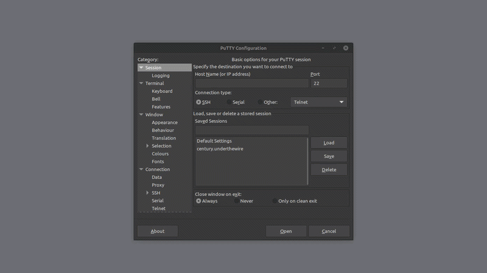

> [Century](../README.md) | [UnderTheWire](../../README.md) | [CTF Write-Ups](../../../README.md)

# [Level 11](https://underthewire.tech/century)
> Century, Level 11.

> English | [Spanish](./nivel-11_century_underthewire_esp.md).

> [PDF version](https://drive.google.com/file/d/14pUnm5R0l_Meqm1xs02hbB1mIbG-Cb-d/view?usp=sharing).

<br>

---

<br>

## Challenge description.
> The password for Century12 is the name of the hidden file within the contacts, desktop, documents, downloads, favorites, music, or videos folder in the user’s profile.
>
> IMPORTANT NOTE
>
> - Exclude “desktop.ini”.
> - The password will be lowercase no matter how it appears on the screen.

<br>

## Information given by the challenge.
> Useful information from the current or previous levels.
- _hostname_: " century.underthewire.tech ".
- _port_: " 22 " (2220).
- _user_: " century11 ".
- _password_: " windowsupdates110 ".

<br>

---

<br>

## Procedure.

<br>

1. To start, knowing from the challenges description, we know that we have to look for a hidden file in one of the subdirectories under the century11 user folder, excluding the file "desktop.ini" from the search.\
Knowing this, we start with using once again, the [Get-ChildItem](https://learn.microsoft.com/es-es/powershell/module/microsoft.powershell.management/get-childitem?view=powershell-7.5#:~:text=Obtiene%20los%20elementos%20y%20elementos%20secundarios%20de%20una%20o%20varias%20ubicaciones%20especificadas) cmdlet. After deciding the cmdlet we are going to use, and specifying the path in which the search is going to be done ("`` .. ``", from _desktop_ of course), we search for other options of this command and other cmdlets we can use to make the search more precise.\
We start with [-Recurse](https://learn.microsoft.com/es-es/powershell/module/microsoft.powershell.management/get-childitem?view=powershell-7.5#:~:text=False-,%2DRecurse), option that specifies that we want to start the search in the specified location but also, continued at every possible subdirecty that this locations presents. We will also implement [-File](https://learn.microsoft.com/es-es/powershell/module/microsoft.powershell.management/get-childitem?view=powershell-7.5#:~:text=%2DFile) to establish that we are looking for a file and not a directory, and combine it with [-Hidden](https://learn.microsoft.com/es-es/powershell/module/microsoft.powershell.management/get-childitem?view=powershell-7.5#:~:text=%2DHidden) to guide the search only towards hidden files. The final option available to the [Get-ChildItem](https://learn.microsoft.com/es-es/powershell/module/microsoft.powershell.management/get-childitem?view=powershell-7.5#:~:text=Obtiene%20los%20elementos%20y%20elementos%20secundarios%20de%20una%20o%20varias%20ubicaciones%20especificadas) that we are going to use is [-Exclude](https://learn.microsoft.com/es-es/powershell/module/microsoft.powershell.management/get-childitem?view=powershell-7.5#:~:text=False-,%2DExclude), to make sure we don't include "desktop.ini" in the search, as the description of the challenge tells us.\
After all of this, we should have the search well oriented towards the file in question. What I am going to do as a last addition, is to put at the end of the command the parameter "`` -ErrorAction ``" followed by the "`` SilentlyContinue ``" value. This allows us to not show any non-fatal error messages, considering that in this case we might have a couple of them, especially under the century11, where we don't have privileges or permissions to access all directories, so we reduce the number of these as much as possible for cleaner output.\
This is how the entire command should look like...

<br>

```powershell


	PS C:\users\century11\desktop> Get-ChildItem .. -Recurse -File -Hidden ` 
    >> -Exclude "desktop.ini" -ErrorAction SilentlyContinue
    >>


    Directory: C\users\century11\AppData\Local\Microsoft\Windows

	Mode                LastWriteTime         Length Name
	----                -------------         ------ ----
	-a-h--        8/30/2018   3:11 AM           8192 UsrClass.dat 
	
    -a-hs-        8/30/2018   3:11 AM           8192 UsrClass.dat.LOG1                                             
	
    -a-hs-        8/30/2018   3:11 AM           8192 UsrClass.dat.LOG2                                             
	
    -a-hs-        8/30/2018   3:11 AM          65536 UsrClass.dat{d82669b3-abff-
    11e8-90ee-e14c26db97e8}.TM.blf     
	
    -a-hs-        8/30/2018   3:11 AM         524288 UsrClass.dat{d82669b3-abff-
    11e8-90ee-e14c26db97e8}.TMContainer00000000000000000001.regtrans-ms
    
	-a-hs-        8/30/2018   3:11 AM         524288 UsrClass.dat{d82669b3-abff-
    11e8-90ee-e14c26db97e8}.TMContainer00000000000000000002.regtrans-ms


    	Directory: C:\users\century11\Downloads

	Mode                LastWriteTime         Length Name         
	----                -------------         ------ ----         
	--rh--        8/30/2018   3:34 AM             30 secret_sauce


    	Directory: C:\users\century11

	Mode                LastWriteTime         Length Name
	----                -------------         ------ ----                                          
	-a-h--        3/30/2026   8:55 PM         262144 NTUSER.DAT
    
	-a-hs-        8/30/2018   3:11 AM          98304 ntuser.dat.LOG1                                                
	
    -a-hs-        8/30/2018   3:11 AM         126976 ntuser.dat.LOG2                                                
	
    -a-hs-        7/12/2020  10:55 PM          65536 NTUSER.DAT{0f893ee4-78e5-11e6-
    90dd-eefb07825ed9}.TM.blf        
	
    -a-hs-        6/14/2020   4:36 AM         524288 NTUSER.DAT{0f893ee4-78e5-11e6-
    90dd-eefb07825ed9}.TMContainer00000000000000000001.regtrans-ms 

	-a-hs-        7/12/2020  10:55 PM         524288 NTUSER.DAT{0f893ee4-78e5-11e6-
    90dd-eefb07825ed9}.TMContainer00000000000000000002.regtrans-ms 

	---hs-        8/30/2018   3:11 AM             20 ntuser.ini


```

<br>

- As we can see, in the output of the command we just executed, we get quite a bit of different hidden files that are under century. Now, there's only one of these that comes from one of the subdirectories detailed in the description of the challenge (" [...] within the contacts, desktop, documents, downloads, favorites, music, or videos folder [...]"), that being "`` secret_sauce ``", under the _downloads_ folder ( century12 : secret_sauce ).

<br>

---

<br>

### Attachments.

<br>

<p align="center">
  
</p>

> Entire procedure.

<br>

---

