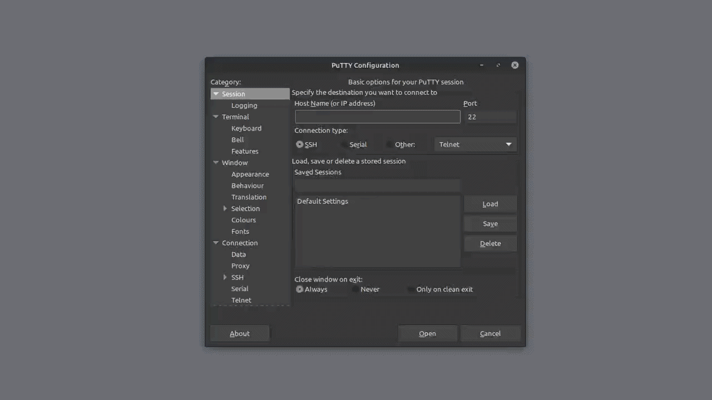

> [Century](../README.md) | [UnderTheWire](../../README.md) | [CTF Write-Ups](../../../README.md)

# [Level 2](https://underthewire.tech/century)
> Century Level 2

> English | [Spanish](./nivel-2_century_underthewire_esp.md).

> [PDF version](https://drive.google.com/file/d/1v_rgNv4OP_Q7r_mAWUZGHU99uwzWVpBx/view?usp=sharing).

<br>

---

<br>

## Challenge description.
> The password for Century3 is the name of the built-in cmdlet that performs the wget like function within PowerShell PLUS the name of the file on the desktop.
>
> - IMPORTANT NOTE:
> - If the name of the cmdlet is “get-web” and the file on the desktop is named “1234”, the password would be “get-web1234”.
> - The password will be lowercase no matter how it appears on the screen.

<br>

## Information given by the challenge.
> Useful information given by the previous level.
- _hostname_: " century.underthewire.tech ".
- _port_: " 22 " (2220).
- _user_: " century2 ".
- _password_: " 10.0.14393.8688 ".

<br>

---

<br>

## Procedure.

<br>

1. After some research and searches, we come to the conclusion that the closest thing to a [wget](https://man7.org/linux/man-pages/man1/wget.1.html) alternative in Powershell is the cmdlet [Invoke-WebRequest](https://www.pdq.com/powershell/invoke-webrequest/). You can also find it using
the alias " iwr " to use it. 
We can check for both on the system, the cmdlet and the alias, using the [Get-Command](https://www.pdq.com/powershell/get-command/) cmdlet. 

<br>

```powershell

    PS C:\users\century2\desktop> Get-Command Invoke-WebRequest

	CommandType     Name                                               	Version    Source
	-----------     ----                                               -------    ------
	Cmdlet          Invoke-WebRequest                                  3.1.0.0    Microsoft.PowerShell.Utility


	PS C:\users\century2\desktop> Get-Command iwr

	CommandType     Name                                               Version    Source
	-----------     ----                                               -------    ------
	Alias           iwr -> Invoke-WebRequest

```

<br>

- As well as we can get a full in depth description of it by using [Get-Help](https://www.pdq.com/powershell/get-help/).

<br>

```powershell

	PS C:\users\century2\desktop> Get-Help iwr

	NAME
    	Invoke-WebRequest

	SYNOPSIS
    	Gets content from a web page on the Internet.


	SYNTAX
    	Invoke-WebRequest [-Uri] <Uri> [-Body <Object>] [-Certificate <X509Certificate>] [-CertificateThumbprint <String>]
    	[-ContentType <String>] [-Credential <PSCredential>] [-DisableKeepAlive] [-Headers <IDictionary>] [-InFile <String>]
    	[-MaximumRedirection <Int32>] [-Method {Default | Get | Head | Post | Put | Delete | Trace | Options | Merge | Patch}]
    	[-OutFile <String>] [-PassThru] [-Proxy <Uri>] [-ProxyCredential <PSCredential>] [-ProxyUseDefaultCredentials]
    	[-SessionVariable <String>] [-TimeoutSec <Int32>] [-TransferEncoding {chunked | compress | deflate | gzip | identity}]
    	[-UseBasicParsing] [-UseDefaultCredentials] [-UserAgent <String>] [-WebSession <WebRequestSession>]
    	[<CommonParameters>]


	DESCRIPTION
    	The Invoke-WebRequest cmdlet sends HTTP, HTTPS, FTP, and FILE requests to a web page or web service. It parses the
    response and returns collections of forms, links, images, and other significant HTML elements.

    	This cmdlet was introduced in Windows PowerShell 3.0.


	RELATED LINKS
    	Online Version: http://go.microsoft.com/fwlink/?LinkId=821826
    	Invoke-RestMethod
    	ConvertFrom-Json
    	ConvertTo-Json

	REMARKS
    	To see the examples, type: "get-help Invoke-WebRequest -examples".
    	For more information, type: "get-help Invoke-WebRequest -detailed".
    	For technical information, type: "get-help Invoke-WebRequest -full".
    	For online help, type: "get-help Invoke-WebRequest -online"

```

<br>

---

<br>

2. Knowing this, and already being in the desktop folder, we use [ls](https://man7.org/linux/man-pages/man1/ls.1.html) trying to see the file in question and it´s name, as said in the description of the challenge...

<br>

```powershell

	PS C:\users\century2\desktop> ls


    	Directory: C:\users\century2\desktop


	Mode                LastWriteTime         Length Name
	----                -------------         ------ ----
	-a----        8/30/2018   3:29 AM            693 443

```

<br>

- And given the output of the [ls](https://man7.org/linux/man-pages/man1/ls.1.html) command, we come to know that the name of the file is " 443 ".

<br>

---

<br>

3. So, following the format for the password given in the description of the challenge, and knowing the elements that make up that password, we proceed to try to log in to century3 with our resulting password, this being " invoke-webrequest443 ".

<br>

```powershell

	PS C:\Users\fdm> ssh century3@century.underthewire.tech
	century3@century.underthewire.tech's password: 
	

	Windows PowerShell
	Copyright (C) 2016 Microsoft Corporation. All rights reserved.
	
	Under the Wire... PowerShell Training for the People!
	PS C:\users\century3\desktop>

```

<br>

- And that should be the end result where you to log in with the correct credentials.

<br>

---

<br>

### Attachments.

<br>

<p align="center">
  
</p>

> Entire procedure.

<br>

---
