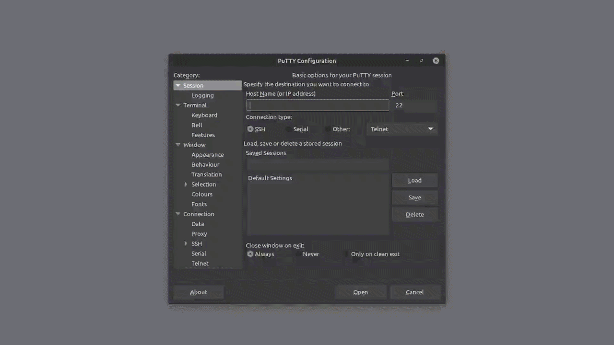

> [Century](../README.md) | [UnderTheWire](../../README.md) | [CTF Write-Ups](../../../README.md)

# [Level 3](https://underthewire.tech/century)
> Century Level 3

> English | [Spanish](./nivel-3_century_underthewire_esp.md).

> [PDF version]().

<br>

---

<br>

## Challenge description.
> The password for Century4 is the number of files on the desktop.

<br>

## Information given by the challenge.
> Useful information given by the previous level.
- _hostname_: " century.underthewire.tech ".
- _port_: " 22 " (2220).
- _user_: " century3 ".
- _password_: " invoke-webrequest443 ".

<br>

---

<br>

## Procedure.

<br>

1. I always like to check my position in the file structure, even if PowerShell always gives it to you always once you have logged into the server, and they also always give it in the structure of the command prompt.\
For that purpose we can use [Get-Location](https://www.pdq.com/powershell/get-location/) or we can also use [gl](https://learn.microsoft.com/es-es/powershell/module/microsoft.powershell.management/get-location?view=powershell-7.5#notes:~:text=PowerShell%20incluye%20los%20siguientes%20alias%20para%20Get%2DLocation%3A) or [pwd](https://learn.microsoft.com/es-es/powershell/module/microsoft.powershell.management/get-location?view=powershell-7.5#notes:~:text=PowerShell%20incluye%20los%20siguientes%20alias%20para%20Get%2DLocation%3A), the two working aliases of the [Get-Location](https://www.pdq.com/powershell/get-location/) cmdlet that work exactly in the same way as the original cmdlet. 

<br>

- In the first case, using [Get-Location](https://www.pdq.com/powershell/get-location/)...

```powershell

    PS C:\users\century2\desktop> Get-Location
    
    Path
    ----
    C:\users\century3\desktop

```

<br>

- using the second option, [gl](https://learn.microsoft.com/es-es/powershell/module/microsoft.powershell.management/get-location?view=powershell-7.5#notes:~:text=PowerShell%20incluye%20los%20siguientes%20alias%20para%20Get%2DLocation%3A)...

```powershell

    PS C:\users\century2\desktop> gl
    
    Path
    ----
    C:\users\century3\desktop

```

<br>

- or with the third one, just using [pwd](https://learn.microsoft.com/es-es/powershell/module/microsoft.powershell.management/get-location?view=powershell-7.5#notes:~:text=PowerShell%20incluye%20los%20siguientes%20alias%20para%20Get%2DLocation%3A)...

```powershell

    PS C:\users\century2\desktop> pwd
    
    Path
    ----
    C:\users\century3\desktop

```

<br>

---

<br>

2. Now that we are sure of our ubication in the file system, and knowing that the password for the next level is the number of folders in this levels desktop, we look for an alternative in PowerShell to the [ls](https://learn.microsoft.com/es-es/powershell/module/microsoft.powershell.management/get-childitem?view=powershell-7.5#:~:text=PowerShell%20incluye%20los%20siguientes%20alias%20para%20Get%2DChildItem) linux shell and cmd command.\
If you take a look in the Microsoft documentation, you end up noticing that the [ls](https://learn.microsoft.com/es-es/powershell/module/microsoft.powershell.management/get-childitem?view=powershell-7.5#:~:text=PowerShell%20incluye%20los%20siguientes%20alias%20para%20Get%2DChildItem) command works in PowerShell as a cmdlet, but it does only as an alias, the original cmdlet being [Get-ChildItem](https://learn.microsoft.com/es-es/powershell/module/microsoft.powershell.management/get-childitem?view=powershell-7.5). This cmdlet also has [gci](https://learn.microsoft.com/es-es/powershell/module/microsoft.powershell.management/get-childitem?view=powershell-7.5#:~:text=PowerShell%20incluye%20los%20siguientes%20alias%20para%20Get%2DChildItem), and [dir](https://learn.microsoft.com/es-es/powershell/module/microsoft.powershell.management/get-childitem?view=powershell-7.5#:~:text=PowerShell%20incluye%20los%20siguientes%20alias%20para%20Get%2DChildItem) as aliases alongside [ls](https://learn.microsoft.com/es-es/powershell/module/microsoft.powershell.management/get-childitem?view=powershell-7.5#:~:text=PowerShell%20incluye%20los%20siguientes%20alias%20para%20Get%2DChildItem).
Now, this cmdlet or any of its aliases aren't enough by itself to get a count of the contents of the folder, given that their function by default using it without arguments is to give a terminal print of the contents on the indicated ubication. That's when we look at the options and arguments that this cmdlet has and a couple other cmdlets that can help us achieving this information.\
When it comes to the search amongst the contents of the folder, to make it more specific, we are going to be using the specific location in which we want the cmdlet applied (``` ..\desktop\ ```), and the argument ``` -File ```, to filter the search, indicating  that in the contents of that folder, we want to exclude anything that it's not a normal file, like directories, hidden folder or system files.\
With all of this, we are just obtaining a detailed list of all the files at that location, so we are going to use a pipe, to redirect all of the output that the we have up to this point into the [Measure-Object](https://learn.microsoft.com/es-es/powershell/module/microsoft.powershell.utility/measure-object?view=powershell-7.5#notes) cmdlet. This one is going to take the entire file list of the desktop folder that we are obtaining as an output of the first half of the command (everything previous to the pipe) to make a numerical count of the files, given that this cmdlet is used to make calculations about the property values of objects, like their file type.

<br>

<br>

- This would be the fully formed command using [GetChild-Item](https://learn.microsoft.com/es-es/powershell/module/microsoft.powershell.management/get-childitem?view=powershell-7.5)...

```powershell

	PS C:\users\century2\desktop> Get-ChildItem ../Desktop/ `
    >> -File | Measure-Object
    >>
    
    Count     : 123
    Average   :
    Sum       :
    Maximum   :
    Minimum   :
    Property  :

```
<br>

- using [gci](https://learn.microsoft.com/es-es/powershell/module/microsoft.powershell.management/get-childitem?view=powershell-7.5#:~:text=PowerShell%20incluye%20los%20siguientes%20alias%20para%20Get%2DChildItem)...

```powershell

	PS C:\users\century2\desktop> gci ..\Desktop\ `
    >> -File | Measure-Object
    >>
    
    Count     : 123
    Average   :
    Sum       :
    Maximum   :
    Minimum   :
    Property  :

```

<br>

- or with [ls](https://learn.microsoft.com/es-es/powershell/module/microsoft.powershell.management/get-childitem?view=powershell-7.5#:~:text=PowerShell%20incluye%20los%20siguientes%20alias%20para%20Get%2DChildItem)...

```powershell

	PS C:\users\century2\desktop> ls ..\Desktop\ `
    >> -File | Measure-Object
	>>
    
	Count     : 123
    Average   :
    Sum       :
    Maximum   :
    Minimum   :
    Property  :

```

<br>

- Finally, as we can see in the output of all of these commands, this is where we obtain the number of files in the desktop folder, "123". This is my password for Century's Level 4. 

<br>

---

<br>

### Attachments.

<br>

<p align="center">
  
</p>

> Entire procedure.

<br>

---

