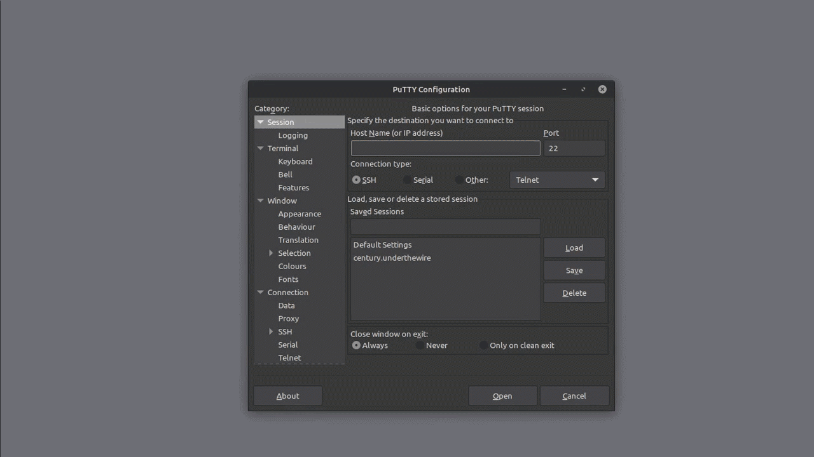

> [Century](../README.md) | [UnderTheWire](../../README.md) | [CTF Write-Ups](../../../README.md)

# [Nivel 4](https://underthewire.tech/century)
> Century Nivel 4

> Español | [Inglés](./level-4_century_underthewire_eng.md).

> [PDF version](https://drive.google.com/file/d/19S4amwzsmAPoWYzu10jGQDXTfZLBTigX/view?usp=sharing).

<br>

---

<br>

## Descripción del _challenge_.
> La contraseña de Century4 es el numero de archivos en el escritorio.

<br>

## Información dada por el _challenge_.
> Información de utilidad dada por el nivel anterior.
- _host-name_: " century.underthewire.tech ".
- _puerto_: " 22 " (2220).
- _usuario_: " century4 ".
- _contraseña_: " 123 ".

<br>

---

<br>

## Procedimiento.

<br>

1. Luego del nivel anterior, sabemos que podemos usar el _cmdlet_ [Get-ChildItem](https://learn.microsoft.com/en-us/powershell/module/microsoft.powershell.management/get-childitem?view=powershell-7.5) para imprimir en la pantalla del terminal los contenidos de determinada ubicación en nuestra computadora. Además de este _cmdlet_, siguiendo la descripción del _challenge_, también sabemos que la contraseña para el siguiente nivel es el nombre de un archivo que está en un directorio que tiene espacios en su nombre, y que a su vez, tiene su ubicación dentro de la carpeta _desktop_.\
Como dijimos, usamos [Get-ChildItem](https://learn.microsoft.com/en-us/powershell/module/microsoft.powershell.management/get-childitem?view=powershell-7.5) y le agregamos `` "* *" `` como adición, para poder indicar que estamos buscando archivos o carpetas con espacios dentro su nombre.\
También agregamos la opción [-Recurse](https://learn.microsoft.com/en-us/powershell/module/microsoft.powershell.management/get-childitem?view=powershell-7.5#:~:text=Gets%20the%20items%20in%20the%20specified%20locations%20and%20in%20all%20child%20items%20of%20the%20locations.). Esta nos permite indicar que queremos la impresión recursiva en terminal de los elementos que cumplan las condiciones de búsqueda. Es decir, en caso de obtener carpetas o directorios que cumplan con las condiciones de búsqueda, además de ver a este impreso en pantalla, también vamos a ver a todos los elementos que este contiene impresos en pantalla de forma detallada, ya sean archivos o subdirectorios. Con todo esto en consideración, ejecutamos el comando...

<br>

```powershell

    PS C:\users\century2\desktop> Get-ChildItem "* *" -Recurse


        Directory: C:\users\century4\desktop\Can You Open Me


    Mode                LastWriteTime         Length Name                                                                
    ----                -------------         ------ ----                                                                
    -a----        4/27/2025   7:57 PM             24 15768 

```

<br>

- Y de esta manera obtenemos el archivo en cuestión y su nombre en el _output_ del comando. Revisando un poco el _output_, nos damos cuenta que hay una carpeta llamada "`` Can You Open Me ``" (que obviamente tiene espacios en su nombre) como subdirectorio de _desktop_, que tiene un archivo en su interior llamado "`` 15768 ``".\
Así es como obtenemos las credenciales para el nivel 5 de Century (century5 : 15768).

<br>

---

<br>

### Adjuntos.

<br>

<p align="center">
  
</p>

> Procedimiento entero.

<br>

---
