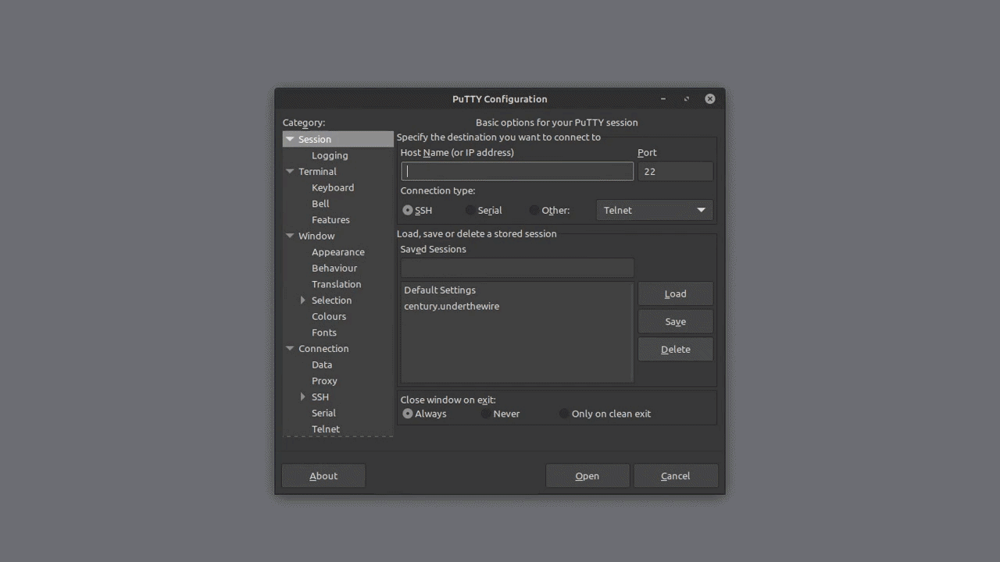

> [Century](../README.md) | [UnderTheWire](../../README.md) | [CTF Write-Ups](../../../README.md)

# [Level 5](https://underthewire.tech/century)
> Century Level 5

> English | [Spanish](./nivel-5_century_underthewire_esp.md).

> [PDF version](https://drive.google.com/file/d/1Qyalc7NQ9-QWEzg_FpkJHu2W9xKqNZ_q/view?usp=drive_link).

<br>

---

<br>

## Challenge description.
> The password for Century6 is the short name of the domain in which this system resides in PLUS the name of the file on the desktop.
>
> **IMPORTANT NOTE**
> If the short name of the domain is “blob” and the file on the desktop is named “1234”, the password would be “blob1234”.
> The password will be lowercase no matter how it appears on the screen.

<br>

## Information given by the challenge.
> Useful information given by the previous level.
- _hostname_: " century.underthewire.tech ".
- _port_: " 22 " (2220).
- _user_: " century4 ".
- _password_: " 123 ".

<br>

---

<br>

## Procedure.

<br>

1. So, following the description of the challenge, we know that we have to obtain 2 pieces of information to reach the password for Century6, the first of those two being the short name of the domain in which our instance of PowerShell is running. This piece of information can also be found in the system as "`` NetBIOSName ``".\
What we can use in this case, is the cmdlet [Get-ADDomain](https://learn.microsoft.com/ja-jp/powershell/module/activedirectory/get-addomain?view=windowsserver2022-ps#:~:text=Gets%20an%20Active%20Directory%20domain.). It allows you to obtain the Active Directory domain specified by the set parameters in the command and a good amount of information about the specified domain.

.

<br>

```powershell

	PS C:\users\century2\desktop> Get-ADDomain

                                                                                                                
    AllowedDNSSuffixes                 : {}                                                                         
    ChildDomains                       : {}                                                                         
    ComputersContainer                 : CN=Computers,DC=underthewire,DC=tech                                       
    DeletedObjectsContainer            : CN=Deleted Objects,DC=underthewire,DC=tech                                 
    DistinguishedName                  : DC=underthewire,DC=tech                                                    
    DNSRoot                            : underthewire.tech                                                          
    DomainControllersContainer         : OU=Domain Controllers,DC=underthewire,DC=tech                              
    DomainMode                         : Windows2016Domain                                                          
    DomainSID                          : S-1-5-21-758131494-606461608-3556270690                                    
    ForeignSecurityPrincipalsContainer : CN=ForeignSecurityPrincipals,DC=underthewire,DC=tech                       
    Forest                             : underthewire.tech                                                          
    InfrastructureMaster               : utw.underthewire.tech                                                      
    LastLogonReplicationInterval       :                                                                            
    LinkedGroupPolicyObjects           : {cn={ECB4A7C0-B4E1-41B1-9E89-161CFA679999},cn=policies,cn=system,DC=undert 
                                        hewire,DC=tech, CN={31B2F340-016D-11D2-945F-00C04FB984F9},CN=Policies,CN=S 
                                        ystem,DC=underthewire,DC=tech}                                             
    LostAndFoundContainer              : CN=LostAndFound,DC=underthewire,DC=tech                                    
    ManagedBy                          :                                                                            
    Name                               : underthewire                                                               
    NetBIOSName                        : underthewire                                                               
    ObjectClass                        : domainDNS                                                                  
    ObjectGUID                         : bdccf3ad-b495-4d86-a94c-60f0d832e6f0                                       
    ParentDomain                       :                                                                            
    PDCEmulator                        : utw.underthewire.tech                                                      
    PublicKeyRequiredPasswordRolling   : True                                                                       
    QuotasContainer                    : CN=NTDS Quotas,DC=underthewire,DC=tech                                     
    ReadOnlyReplicaDirectoryServers    : {}                                                                         
    ReplicaDirectoryServers            : {utw.underthewire.tech}                                                    
    RIDMaster                          : utw.underthewire.tech                                                      
    SubordinateReferences              : {DC=ForestDnsZones,DC=underthewire,DC=tech,                                
                                        DC=DomainDnsZones,DC=underthewire,DC=tech,                                 
                                        CN=Configuration,DC=underthewire,DC=tech}                                  
    SystemsContainer                   : CN=System,DC=underthewire,DC=tech                                          
    UsersContainer                     : CN=Users,DC=underthewire,DC=tech

```

<br>

- That's how, in the output of [Get-ADDomain](https://learn.microsoft.com/ja-jp/powershell/module/activedirectory/get-addomain?view=windowsserver2022-ps#:~:text=Gets%20an%20Active%20Directory%20domain.), we obtain the short name of the domain as "`` NetBIOSName ``", this one being "`` underthewire ``".

<br>

---

<br>

2. Already having in the first part of the command, we go for the second. This should be the name of a file that is on the desktop directory. For that, we just execute [Get-ChildItem](https://learn.microsoft.com/en-us/powershell/module/microsoft.powershell.management/get-childitem?view=powershell-7.5#:~:text=Gets%20the%20items%20and%20child%20items%20in%20one%20or%20more%20specified%20locations.) on that location...

<br>

```powershell

    Directory: C:\users\century5\desktop
                                                                        
                                                                                                                
Mode                LastWriteTime         Length Name                                                           
----                -------------         ------ ----                                                           
-a----        8/30/2018   3:29 AM             54 3347

```

<br>

- And there it is the name of the file, "`` 3347 ``". That's how we obtain the credentials for Century's level 6 (century6 : underthewire3347).

<br>

---

<br>

### Attachments.

<br>

<p align="center">
  
</p>

> Entire procedure.

<br>

---

