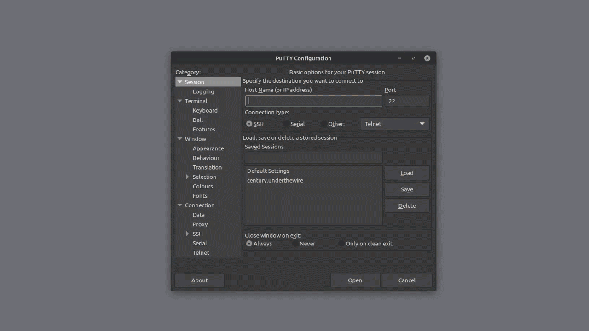

> [Century](../README.md) | [UnderTheWire](../../README.md) | [CTF Write-Ups](../../../README.md)

# [Level 6](https://underthewire.tech/century)
> Century Level 6

> English | [Spanish](./nivel-6_century_underthewire_esp.md).

> [PDF version](https://drive.google.com/file/d/137jBL11jtPgzzo3U8LtZYZcReol3hWbb/view?usp=drive_link).

<br>

---

<br>

## Challenge description.
> The password for Century7 is the number of folders on the desktop.

<br>

## Information given by the challenge.
> Useful information given by the previous level.
- _hostname_: " century.underthewire.tech ".
- _port_: " 22 " (2220).
- _user_: " century6 ".
- _password_: " underthewire3347 ".

<br>

---

<br>

## Procedure.

<br>

1. So, following the description of the challenge, we know that we have to arrive to the number of folder that the desktop directory has, given that apparently, that is the password for Century7.\
For this, we can, once again, use [Get-ChildItem](https://learn.microsoft.com/en-us/powershell/module/microsoft.powershell.management/get-childitem?view=powershell-7.5#:~:text=Gets%20the%20items%20and%20child%20items%20in%20one%20or%20more%20specified%20locations.) almost as we did in Century's Level 3. Only that in this case, instead of "`` -File ``", we are going to be using the "`` -Directory ``" argument to guide the search towards folders, having in mind that that's what interests us in this case. This being said, we place said argument after the location for the search, "`` . ``".\
And finally, we once again add a redirecting pipe to give that output to the "`` Measure-Object ``" cmdlet, to generate the numeric count that we need for all of those folder. That's how we execute the command...

<br>

```powershell

	PS C:\users\century6\desktop> Get-ChildItem . -Directory | Measure-Object


	Count    : 197
	Average  :
	Sum      :
	Maximum  :
	Minimum  :
	Property :

```

<br>

- And as we can see in the output of the command, that's how we obtain the number of folders in the desktop directory, the number being "`` 197 ``" (century7 : 197).

<br>

---

<br>

### Attachments.

<br>

<p align="center">
  
</p>

> Entire procedure.

<br>

---

