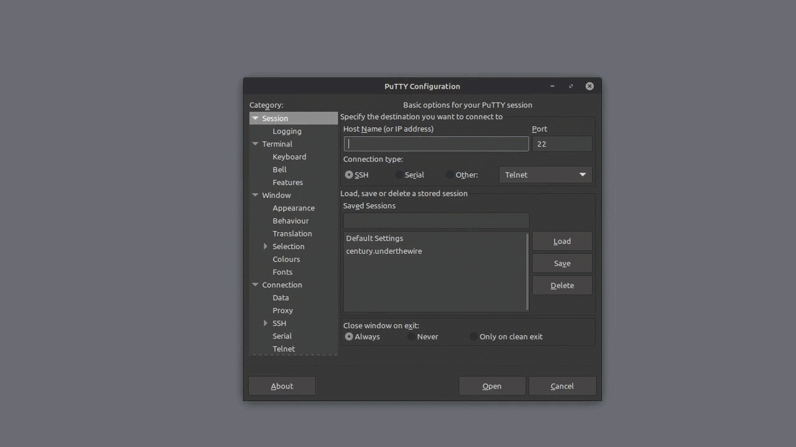

> [Century](../README.md) | [UnderTheWire](../../README.md) | [CTF Write-Ups](../../../README.md)

# [Level 7](https://underthewire.tech/century)
> Century Level 7

> English | [Spanish](./nivel-7_century_underthewire_esp.md).

> [PDF version](https://drive.google.com/file/d/1jHSxyz99lGeDP8-shU2xltJGnk5tpSnW/view?usp=sharing).

<br>

---

<br>

## Challenge description.
> The password for Century8 is in a readme file somewhere within the contacts, desktop, documents, downloads, favorites, music, or videos folder in the user’s profile.
>
> IMPORTANT NOTE
> - The password will be lowercase no matter how it appears on the screen.

<br>

## Information given by the challenge.
> Useful information given by the previous level.
- _hostname_: " century.underthewire.tech ".
- _port_: " 22 " (2220).
- _user_: " century7 ".
- _password_: " 197 ".

<br>

---

<br>

## Procedure.

<br>

1. Looking at the description of this level, we know that the password for Century8 should be stored in a readme file in one of the subdirectories that are under the century8 user (contacts, desktop, documents, downloads, etc).\
To start with the search, we can, once again, use [Get-ChildItem](https://learn.microsoft.com/en-us/powershell/module/microsoft.powershell.management/get-childitem?view=powershell-7.5#:~:text=Gets%20the%20items%20and%20child%20items%20in%20one%20or%20more%20specified%20locations.) indicating it to start the search from the century8 directory ("`` .. ``", from desktop obviously, to go back to the parent directory), given that we know the file is stored somewhere inside one of its subdirectories. We also add `` "*readme*" `` as the string we are going to be looking for as the name of the file, and lastly, we also add "`` -Recurse ``" to indicate the search to be completed amongst all of century8s subdirectories. This command correctly executed should gives the file in question...

<br>

```powershell


	PS C:\users\century7\desktop> Get-ChildItem .. -Recurse "*readme*"


    Directory: C:\users\century7\Downloads


Mode                LastWriteTime         Length Name                                                          
----                -------------         ------ ----                                                          
-a----        8/30/2018   3:29 AM              7 Readme.txt


```

<br>

- And that's how we obtain the file in question and its location.

<br>

---

<br>

2. To print the contents of it, we can pipe the output of the last command to the [Get-Content](https://learn.microsoft.com/en-us/powershell/module/microsoft.powershell.management/get-content?view=powershell-7.5#:~:text=Gets%20the%20content%20of%20the%20item%20at%20the%20specified%20location.) cmdlet, the direct equivalent that PowerShell has to the [cat](https://learn.microsoft.com/en-us/powershell/module/microsoft.powershell.management/get-content?view=powershell-7.5#:~:text=Windows%3A-,cat,-The%20Get%2DContent) command. So we try doing it that way...

<br>

```powershell


	PS C:\users\century7\desktop> Get-ChildItem .. -Recurse "*readme*" | Get-Content
    7points


```

<br>

- as we see in the output of that command, that's how we obtain the password for Century8, this being "`` 7points ``" (century8 : 7points).

<br>

---

<br>

### Attachments.

<br>

<p align="center">
  
</p>

> Entire procedure.

<br>

---
