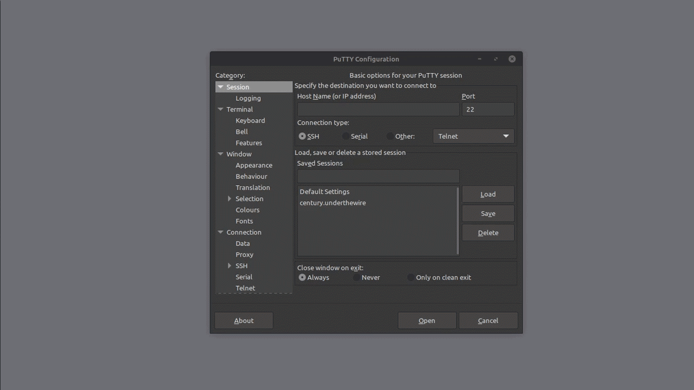

> [Century](../README.md) | [UnderTheWire](../../README.md) | [CTF Write-Ups](../../../README.md)

# [Level 8](https://underthewire.tech/century)
> Century Level 8

> English | [Spanish](./nivel-8_century_underthewire_esp.md).

> [PDF version](https://drive.google.com/file/d/1eQ-Hrm_8Kw1pkWW94wc3W35gi_a044e4/view?usp=sharing).

<br>

---

<br>

## Challenge description.
> The password for Century9 is the number of unique entries within the file on the desktop.

<br>

## Information given by the challenge.
> Useful information given by the previous level.
- _hostname_: " century.underthewire.tech ".
- _port_: " 22 " (2220).
- _user_: " century8 ".
- _password_: " 7points ".

<br>

---

<br>

## Procedure.

<br>

1. So, starting with this level, we know that the password for Century9 is the number of unique data entries that the file on the desktop has. We make a quick use of [Get-ChildItem](https://learn.microsoft.com/en-us/powershell/module/microsoft.powershell.management/get-childitem?view=powershell-7.5#:~:text=Gets%20the%20items%20and%20child%20items%20in%20one%20or%20more%20specified%20locations.) to corroborate for the presence of the file in the desktop and its name.

<br>

```powershell


	PS C:\users\century7\desktop> Get-ChildItem
    
    	Directory: C:\users\century8\desktop

	Mode                LastWriteTime         Length Name
	----                -------------         ------ ----             
    
	-a----        8/30/2018   3:33 AM          15858 unique.txt


```

<br>

- Thats where it is, "`` unique.txt ``".

<br>

---

<br>

2. To get an initial print of its contents, we can once again use [Get-Content](https://learn.microsoft.com/en-us/powershell/module/microsoft.powershell.management/get-content?view=powershell-7.5#:~:text=Gets%20the%20content%20of%20the%20item%20at%20the%20specified%20location.). The problem with this, is that with only that cmdlet and no othe additions to the command, we are only going to be obtaining a print of all the lines in the document, not even the unique ones. So, to get closer to getting a numeric count of the unique ones we need to add a couple other cmdlets to reach that point.\
Considering that we are already getting a print of all the lines in the document with an initial use of [Get-Content](https://learn.microsoft.com/en-us/powershell/module/microsoft.powershell.management/get-content?view=powershell-7.5#:~:text=Gets%20the%20content%20of%20the%20item%20at%20the%20specified%20location.), we can redirect that output with the use of a pipe directly to the [Get-Unique](https://learn.microsoft.com/en-us/powershell/module/microsoft.powershell.utility/get-unique?view=powershell-7.5#:~:text=Returns%20unique%20items%20from%20a%20sorted%20list.) cmdlet. This cmdlet is the closest thing to an equivalent to the [uniq](https://man7.org/linux/man-pages/man1/uniq.1.html#:~:text=uniq%20%2D%20report%20or%20omit%20repeated%20lines) command, that filters and returns unique items from a list.

<br>

```powershell


	PS C:\users\century7\desktop> Get-Content .\unique.txt  | Get-Unique
	recreatively
	proboscidean
	commenceable
	simptico
	zoon
	glacises
	rationaliser
	unlustful
	catnapping
	arboreta
    
    [...]


```

<br>

- Through doing this, we should now be obtaining a print of only the lines that represent unique data entries in that document.

<br>

---

<br>

3. Finally, having filtered the unique lines of that document, we can pipe redirect the result of all of this to [Measure-Object](https://learn.microsoft.com/es-es/powershell/module/microsoft.powershell.utility/measure-object?view=powershell-7.5#notes), to now obtain a numeric count of the unique lines of the document.

<br>

```powershell


	PS C:\users\century8\desktop> Get-Content .\unique.txt `
    >> | Get-Unique | Measure-Object
    >>
    
	Count    : 696
	Average  :                           
	Sum      :                               
	Maximum  :                               
	Minimum  :                               
	Property :


```

<br>

- And how that's how we obtain the flag of this level and the password for the next. The number in question being "`` 696 ``" (century9 : 696).

<br>

---

<br>

### Attachments.

<br>

<p align="center">
  
</p>

> Entire procedure.

<br>

---

